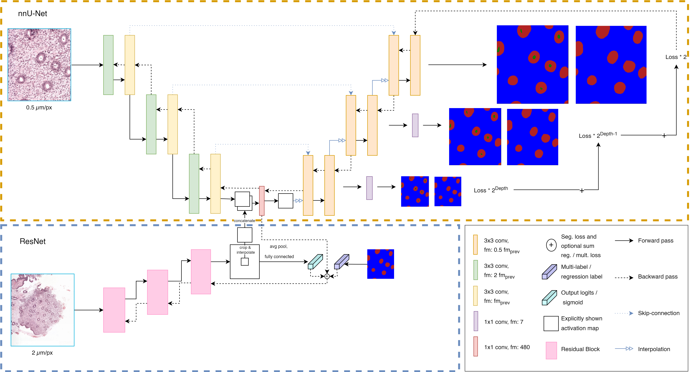

# Multi-resolution in nnU-Net

Images in pathology often contain multiple resolutions. The original nnU-Net architecture has been extended
to utilize this. In this documentation the extra steps required to run nnU-Net with multi-resolution are described.
The figure below is a schematic overview of the adjusted architecture (number of down- and up samplings are
illustrative)



## Plan and preprocessing

`It is assumed that the project root directory contains the nifti files and a dataset.json. If not then refer to` [this](documentation/dataset_conversion.md)

The original plan and preprocessing is designed to use all the VRAM that is available in contemporary GPUs, excluding
a GB or two to allow a margin of error. To use an extra CNN to encode a patch at lower resolution, one is required to
supply the nnUNet_plan_and_preprocess.py with a few extra parameters.

First, set the environment variables:

```
nnUNet_raw_data_base=<path-to-data-directory>;
RESULTS_FOLDER=<path-to-results-directory>;
```

Second, run the nnUNet_plan_and_preprocess command with the following arguments:

```
-t 
<task id>
-tl
0 # set to zero, since no low-resolution data needs to be processed.
-tf
<number of processes for processing data>
--planner2d
ExperimentPlanner2D_v21_MultiScale
-pl3d
None # No 3D planner required when using the multiscale architecture
--planner_kwargs={\"vram_encoder\":<estimated amount of VRAM>,\"force_patch_size\":256,\"force_num_pools\":8,\"plans_fname\":\"nnUNetPlansv2.1_self_configuring_256ps.pkl\"}
```

The planner_kwargs are the key word arguments given to the planner2d. When you want nnU-Net to configure its
architecture
completely autonomously, then remove force_patch_size and force_num_pools from the JSON string. nnU-Net is set to
create a network with a patch size as large as possible while allowing for a batch size of 2 and adjusts the network
depth to have a receptive field covering the entire input patch. However, for pathology a larger batch size seems
to be generalizing better when using batch norm, than the original architecture with instance norm. Therefore,
being able to tweak force_patch_size and force_num_pools will allow for a larger batch size.

When the plans file is created, it will be stored under the project root directory (nnUNet_raw_data_base) in the
nnUNet_preprocessed folder.

Third, run the nnUNet_train command with the following arguments:

```
2d
nnUNetTrainerV2MultiScale
<task name or id>
<fold number>
-p
<plans filename from the nnUNet_plan_and_preprocess step>
--trainer_kwargs="{\"encoder_kwargs\":{\"arch\":\"resnet18\",\"pretrained\":false,\"trainable\":true},\"data_origin\":\"/data/pathology/archives/endometrium/endoaid/wsis/development/dense_annotations/tif/*\",\"spacing\":2.0,\"plot_validation_results\":true,\"debug_plot_color_values\":\"white,firebrick,pink,purple,red,green,blue,blue\",\"norm_op\":\"batch\"}"
```

For trainer_kwargs it is important that this is an escaped json string with no spaces, or it won't be parsed properly.
The json string above is just an example.
See [nnUNetTrainerV2Multiscale](../../nnunet/training/network_training/diag/nnUNetTrainerV2MultiScale.py) for
explanations of all the different parameters.

When all folds are trained it is time to run prediction on the test set and this requires the same trainer_kwargs to be
passed or the model cannot be instantiated:

```
-t
<task name or id>
-i
<folder of the test images>
-o
<folder to store output>
-m
2d 
-p
<same plans file>
-tr
nnUNetTrainerV2MultiScale
-chk
model_best
--save_npz
--trainer_kwargs=<same trainer_kwargs as with training>
```


